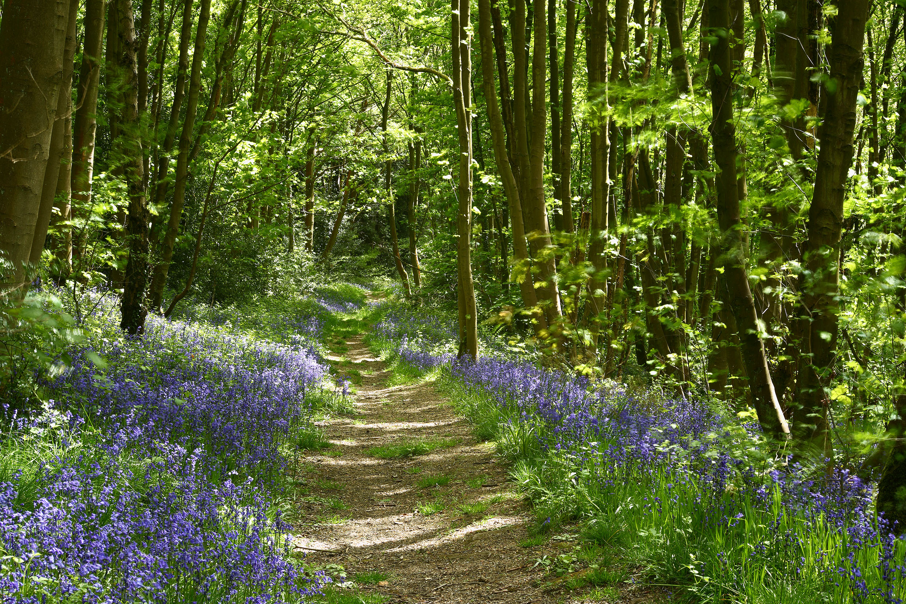

# C1 Broadleaved high forest

*Photo: Chris Gilbert*

## Definition of landscape category

Broadleaved high forest - Areas greater than 0.25 ha, which are wider than 2Om and having a tree canopy cover  of  at least  20%  by  area.   At  least  80%  of  the  canopy  should  be  of  broadleaved species.

## UK Definition of habitat

* **Woodland Trust** [https://www.woodlandtrust.org.uk/trees-woods-and-wildlife/habitats/broadleaved-woodland/](https://www.woodlandtrust.org.uk/trees-woods-and-wildlife/habitats/broadleaved-woodland/)

## Aerial Definition

## In the Peak District

The PDNP is notable for its general scarcity of woodlands, with around 8% tree coverage: below the UK woodland coverage of 13% and well below the global average of around 30%

  <b>Forestry Commission Estimate © 2019 National Forest Inventory Woodland Map – Areas of woodland</b>

Woodland type|Area (ha) in the PDNP|% of total area of woodland
:-----:|:-----:|:-----:
Broadleaved|6,624|55.2%
Conifer|3,461|28.8%
Felled|587|4.9%
Young trees|249|2.1%
Other|1,084|9%
Total|12,005|100%

*Note: the National Forest Inventory maps the extent and location of all woodland over 0.5ha in size and at least 20m in width.

While all three NCAs in the PDNP have a scarcity of woodland, there is some variation in the extent and type of tree cover. Woodland coverage is around 10% in the Dark Peak, 8% in the South West Peak and 6% in the White Peak. There is less coniferous woodland in the White Peak than the Dark or South West Peak. According to Natural England figures, only 1% of the PDNP is covered by ancient woodland; 1,417ha is ancient and semi-natural woodland and 689ha is plantation on ancient woodland.
