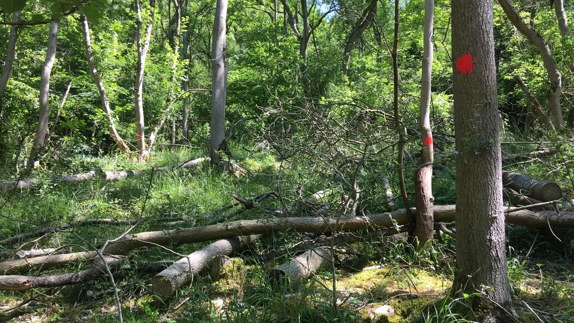
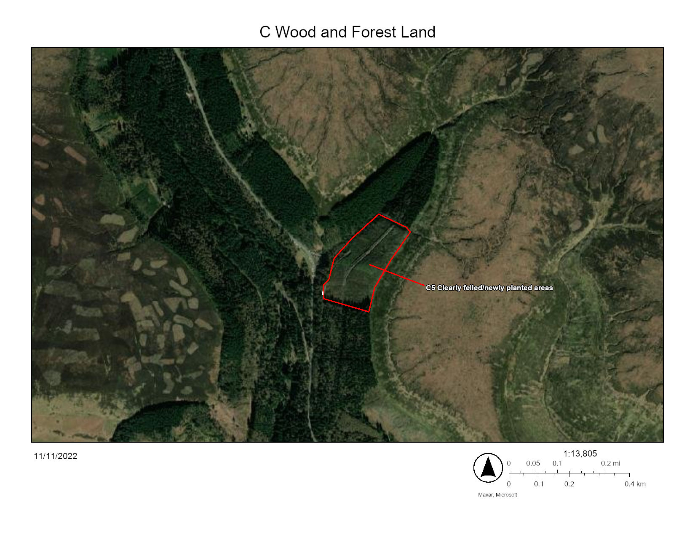

# C5 Clear felled / new plantings in forest areas

*Photo: National Trust*

## Definition of landscape category

Clear felled/new plantings in forest areas - Areas with hard boundaries, generally integral with stands of high forest and which have recently been felled or planted. Evidence of logging, rowing up of trash and drainage may be present.

## UK Definition of habitat

* **Woodland Trust scrub** [https://www.suffolkwildlifetrust.org/conservationadvice/meadows-and-grassland/grassland-and-scrub](https://www.suffolkwildlifetrust.org/conservationadvice/meadows-and-grassland/grassland-and-scrub)

## Aerial Definition

## In the Peak District

Scrub and hedges have not been mapped or surveyed adequately to calculate their extent in the PDNP. Further research is needed on both the extent and condition of scrub and hedges, in particular the need to identify potentially important sites.

Climate change and diseases such as [Phytophthora - Larch Disease](https://www.peakdistrict.gov.uk/visiting/frequently-asked-questions/tree-felling-in-the-goyt-valleyphytophera) and [Ash Dieback](https://www.nationaltrust.org.uk/ilam-park-dovedale-and-the-white-peak/features/tackling-ash-dieback-in-dovedale) means this is a much more common site in our native trees as well as for forestry practice or the removal of non-native trees for biodiversity improvement.
