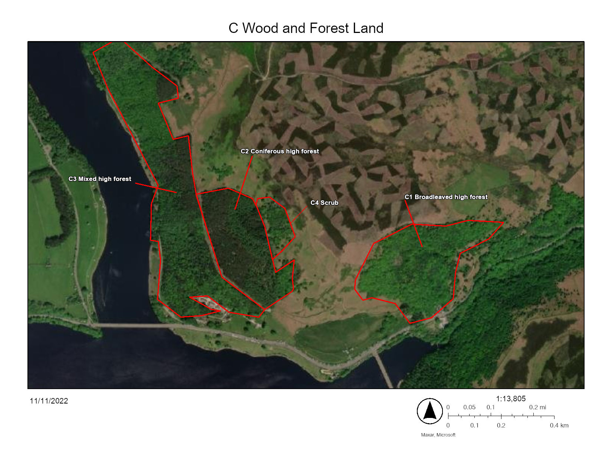

# C2 Coniferous high forest

*Photo: Google Maps*

## Definition of landscape category

Coniferous high forest - Areas greater than 0.25 ha, wider than 20 m, and have a tree canopy cover of at least 20% . At least 80% of the canopy should be of coniferous species.

Coniferous high forest - Usually grown from planted seedlings consisting of large, tall mostly scale or needle leaved, cone bearing mature trees with a closed canopy.  This grouping included the deciduous European larch (Larix decidua). Coniferous high forest is planted as for commercial cropping in ordered stands of the same age (plantation). Easily recognisable in imagery as uniformly aged, coloured and spaced plantings with clearly defined borders/edges between stands of trees. 

## Aerial definition of landscape category

* [Google photo sphere Macclesfield Forest](https://goo.gl/maps/JdXjgJih88fhdv1A6) 

## In the Peak District

There is less coniferous woodland in the White Peak than the Dark or South West Peak. Larger plantations hold the biggest area of coniferous woodland in the Macclesfield Forest and Goyt Valley in the South West Peak and the in the dark Peak around the Howden/ Derwent/ Ladybower reservoir sequence and the reservoirs on the Sheffield border.

* [Wildlife Trust: Coniferous Plantation](https://www.wildlifetrusts.org/habitats/woodland/coniferous-plantation)