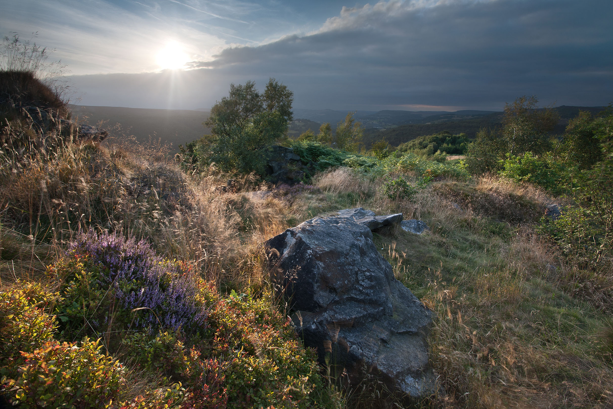

# C4 Scrub

*Photo: Chris Gilbert*

## Definition of landscape category

Areas with diffused boundaries with less than 2O% cover by area of mature timber species with a rough understory of shrubs and grasses. Trees such as;

* Birch (Betula spp)
* Alder Alnus glutinosa)
* Willow (Salix spp)
* Hazel (Corylus avellana)

must be less than 3.5 m high although shrubs such as Blackthorn (Prunus spinosa) and Hawthorn (Crataegus spp) may be higher.

## UK Definition of habitat

* **Woodland Trust scrub** [https://www.suffolkwildlifetrust.org/conservationadvice/meadows-and-grassland/grassland-and-scrub](https://www.suffolkwildlifetrust.org/conservationadvice/meadows-and-grassland/grassland-and-scrub)

## Aerial Definition

## In the Peak District

Scrub and hedges have not been mapped or surveyed adequately to calculate their extent in the PDNP. Further research is needed on both the extent and condition of scrub and hedges, in particular the need to identify potentially important sites.
